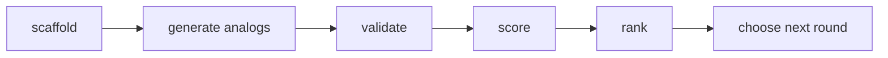

# Lesson 03: Ownership and Borrowing Through Molecule Design

## Goal

Students learn Rust ownership and borrowing through a molecule-design workflow:
who owns a molecule, who may inspect it, and who may change it.

## Visuals

- [Ownership and borrowing contract](../visuals/plantuml/ownership-borrowing-contract.puml)
- [Molecule design flow](../visuals/plantuml/molecule-design-flow.puml)

## Hook

Put one molecule card on a table. Give students role cards:

- owner
- reader
- editor
- scorekeeper

Ask:

Who is allowed to change the molecule while others are reading it?

Rust answer:

Many immutable borrows or one mutable borrow, but not both at the same time.

## School Version

Use lab roles:

- The owner holds the molecule.
- Readers can count atoms and bonds.
- The editor can add a substituent, but only after readers step away.
- The scorekeeper writes a score after reading.

Lesson:

Safe sharing is not about distrust. It is about preventing two people from editing
the same blueprint at the same time.

## University Version

Design API choices:

```rust
fn score(molecule: &Molecule) -> f64
```

Borrow when the algorithm only reads.

```rust
fn add_atom(molecule: &mut Molecule, atom: Atom)
```

Use a mutable borrow when the algorithm edits an existing molecule.

```rust
fn with_substitution(scaffold: &Molecule, atom: Atom) -> Molecule
```

Return a new molecule when the scaffold should remain unchanged.

## Molecule Design Pipeline



Rust interpretation:

- scaffold is borrowed by generators
- candidates are owned values
- validators borrow candidates
- scoring functions borrow candidates
- ranking owns or references scored results

## Discussion

When is cloning acceptable?

- Good: small toy molecule for a beginner exercise.
- Maybe: classroom examples where clarity matters more than speed.
- Risky: large molecular libraries or production docking workflows.

When should invalid states be impossible?

- Element names should be enum variants.
- Bond indices need runtime validation.
- Full chemical validity needs domain rules beyond the toy model.

## Challenge

Write a function signature for each task:

1. Count atoms without changing the molecule.
2. Add a bond to an existing molecule.
3. Create a new analog while preserving the original scaffold.
4. Score a molecule without taking ownership.
