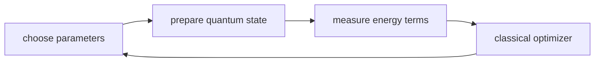

# Lesson 04: Quantum State and Molecular Simulation

## Goal

Students learn why a molecule is not fully described by a graph and why quantum
state matters for molecular simulation.

## Visuals

- [Quantum simulation loop](../visuals/plantuml/quantum-simulation-loop.puml)
- [Course map](../visuals/mermaid/course-map.md)

## Hook

Show two representations:

1. A molecule graph: atoms and bonds.
2. A statement: "electrons determine energy, shape, color, and reactivity."

Ask:

Where are the electrons in the graph?

Answer:

Mostly absent. The graph is useful, but it is not the whole molecule.

## School Version

Use wave cards:

- A blue card means outcome A is likely.
- A red card means outcome B is likely.
- Students can know the rule before reveal, but not the measured outcome.

Teacher line:

Quantum state is not secret classical information. It is a different physical
description that produces measurement outcomes.

Avoid:

"A qubit stores 0 and 1 at the same time like two normal bits."

Use instead:

"A qubit has amplitudes. Measurement gives one outcome, and the amplitudes control
the probabilities."

## University Version

Connect the levels:

| Level | Representation | Example question |
| --- | --- | --- |
| graph | atoms and bonds | Which atoms are connected? |
| geometry | 3D coordinates | Can this fit into a binding pocket? |
| force field | approximate energy terms | Which conformation is lower energy? |
| quantum state | amplitudes and operators | What electronic state gives this energy? |

## VQE Intuition

Variational quantum eigensolver, at a high level:

1. Choose a trial quantum state.
2. Measure energy terms.
3. Adjust parameters.
4. Repeat until the energy stops improving.

What students should remember:

- The quantum computer prepares and measures quantum states.
- The classical computer updates parameters.
- The goal is often a low-energy state.
- This is promising for chemistry, but current hardware is limited.

## Analogy Guardrails

| Tempting shortcut | Better statement |
| --- | --- |
| A qubit is a bigger bit. | A qubit is a quantum state used differently from a classical bit. |
| Quantum computers store all answers. | Algorithms shape amplitudes so useful outcomes become more likely. |
| Molecule graphs are molecules. | Graphs are one useful representation of molecular connectivity. |
| Quantum solves chemistry automatically. | Quantum methods may help with some hard electronic-structure problems. |

## Reflection

Every representation is a deal:

- keep enough detail to answer the question
- drop enough detail to compute
- be honest about what was dropped
