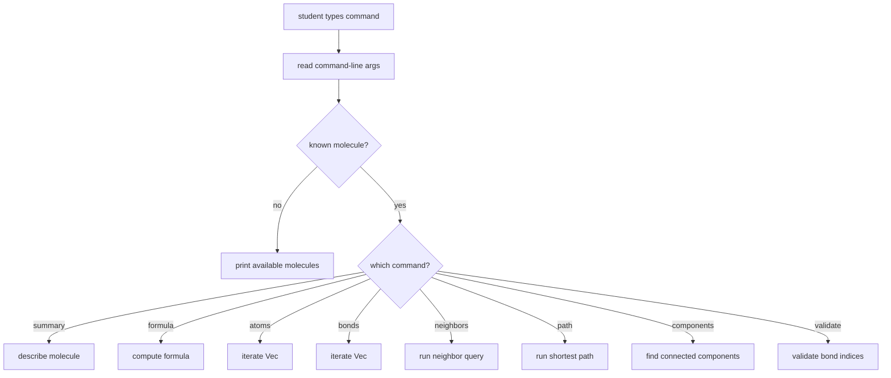

# Mermaid: Molecule Explorer CLI Flow

```mermaid
flowchart TD
    A["student types command"] --> B["read command-line args"]
    B --> C{"known molecule?"}
    C -- "no" --> D["print available molecules"]
    C -- "yes" --> E{"which command?"}
    E -- "summary" --> F["describe molecule"]
    E -- "formula" --> G["compute formula"]
    E -- "atoms" --> H["iterate Vec<Atom>"]
    E -- "bonds" --> I["iterate Vec<Bond>"]
    E -- "neighbors" --> J["run neighbor query"]
    E -- "path" --> K["run shortest path"]
    E -- "components" --> L["find connected components"]
    E -- "validate" --> M["validate bond indices"]
```

Teaching prompt:

Ask students which commands use the molecule as a record and which commands use the
molecule as a graph.

