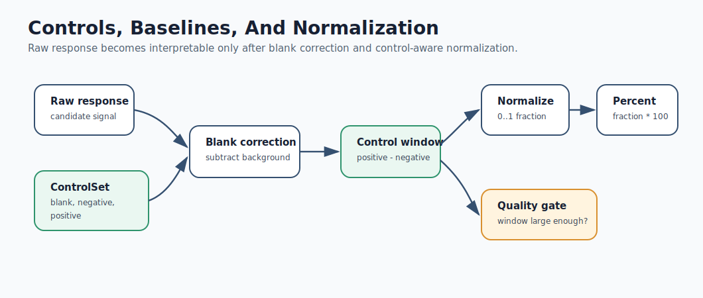
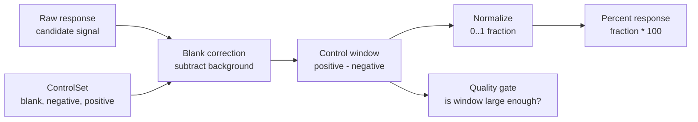

# Mermaid: Controls And Normalization

If GitHub Mermaid rendering is unavailable in your browser, use this rendered SVG:

The editable Mermaid source is below.

Teaching prompt:

Ask students why a raw response cannot be interpreted without reference controls.
