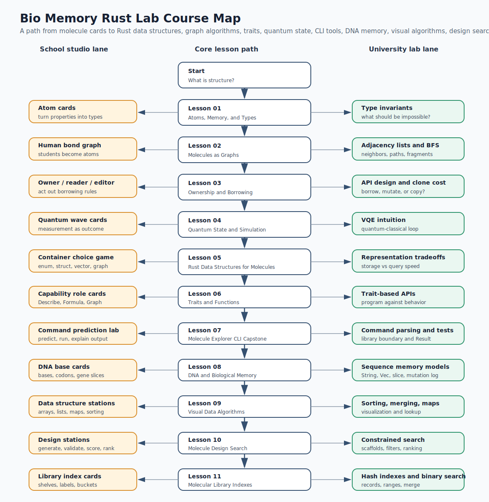
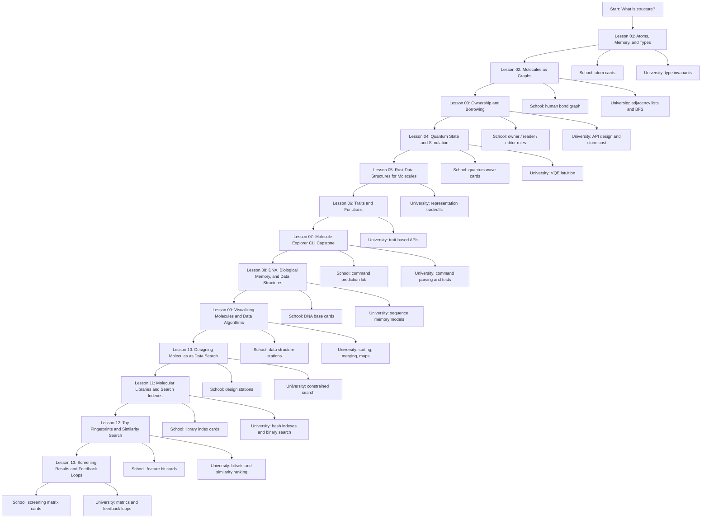

# Mermaid: Course Map

If GitHub Mermaid rendering is unavailable in your browser, use this rendered SVG:

The editable Mermaid source is below.

Teaching prompt:

Ask students where they are in the map before and after each class. The map should
make the course feel like a journey from concrete objects to abstract state.
