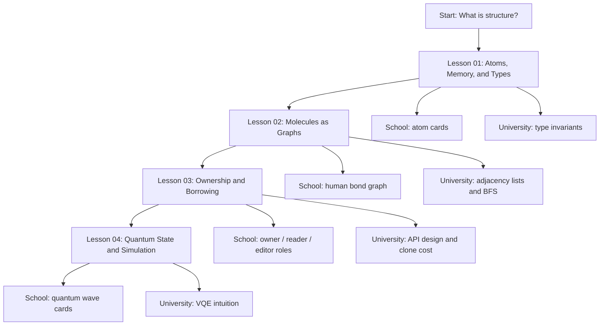

# Mermaid: Course Map

This diagram renders directly on GitHub.

Teaching prompt:

Ask students where they are in the map before and after each class. The map should
make the course feel like a journey from concrete objects to abstract state.

