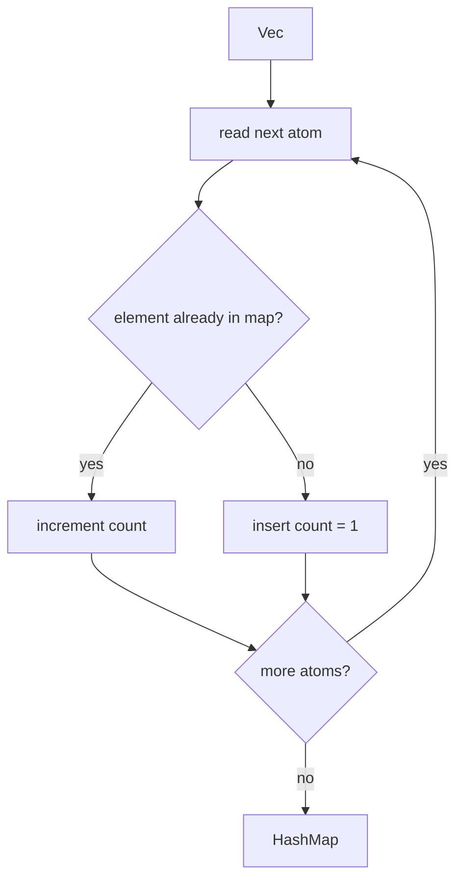
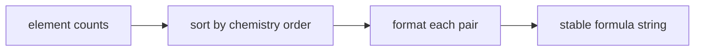
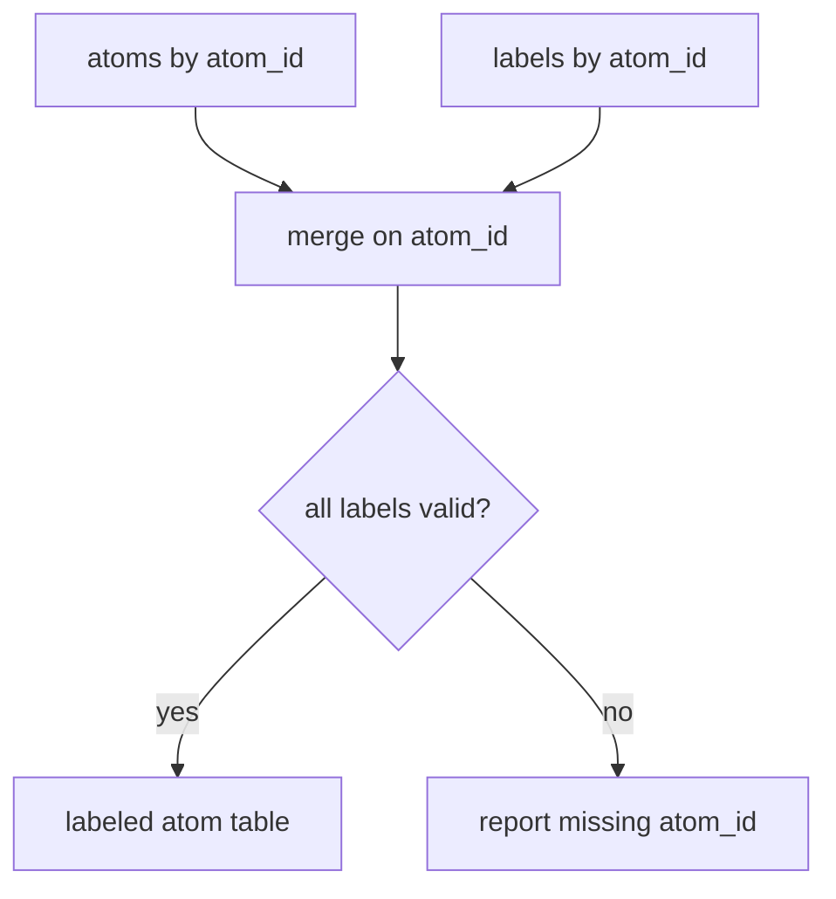
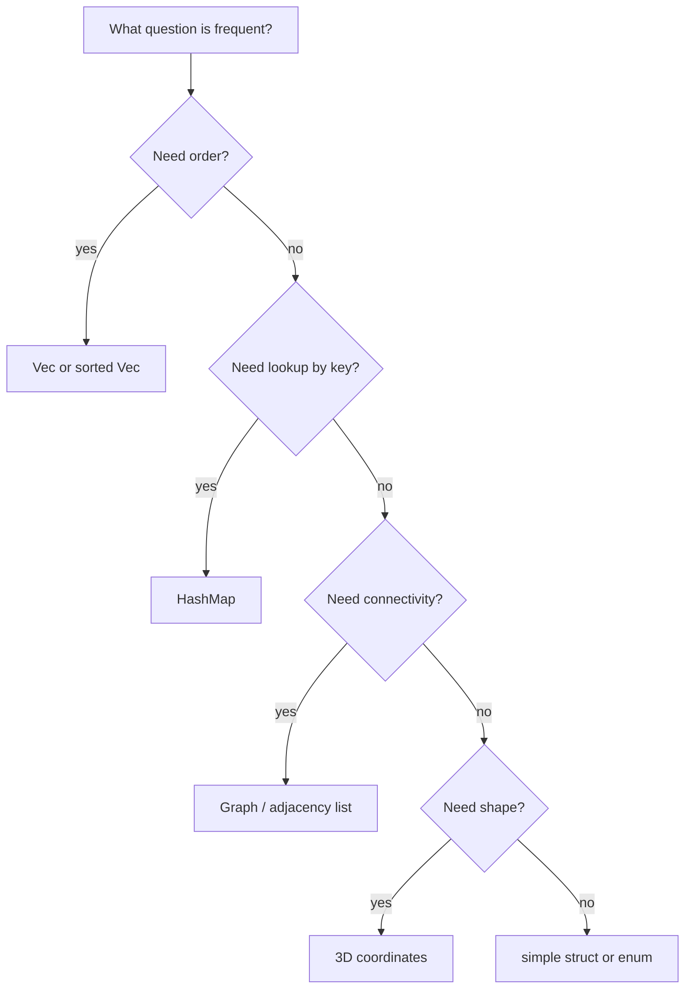

# Mermaid: Data Algorithms

## Count Elements With A Hash Map

## Sort Counts For Formula Output

## Merge Atom Records With Labels

## Choose A Representation

Teaching prompt:

Ask students to name the question first, then pick the data structure.
