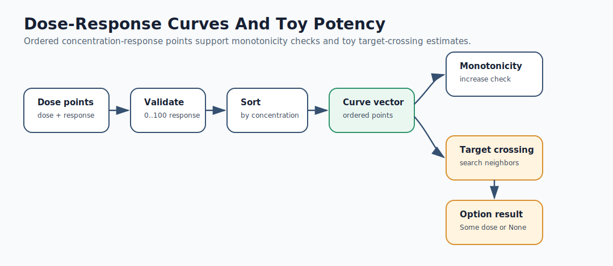
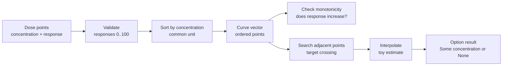

# Mermaid: Dose-Response Curves

If GitHub Mermaid rendering is unavailable in your browser, use this rendered SVG:

The editable Mermaid source is below.

Teaching prompt:

Ask students what assumptions are hidden inside interpolation.
