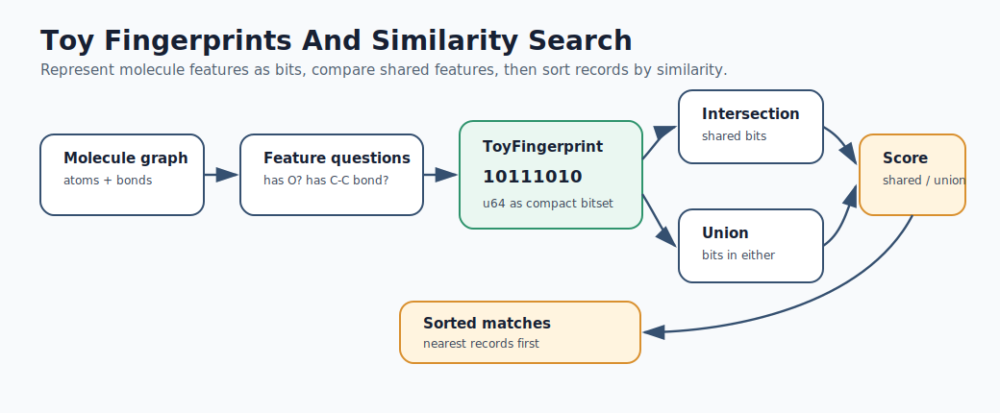
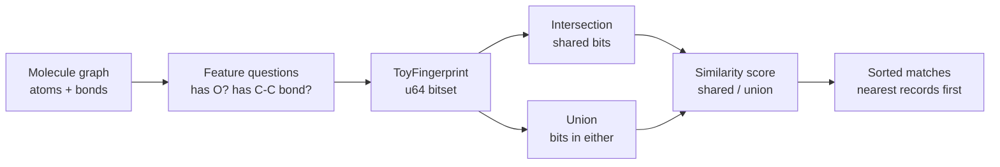

# Mermaid: Toy Fingerprints And Similarity Search

If GitHub Mermaid rendering is unavailable in your browser, use this rendered SVG:

The editable Mermaid source is below.

Teaching prompt:

Ask students what information disappears when a molecule becomes a fingerprint.
