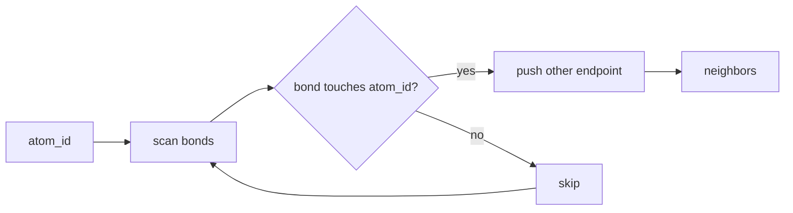
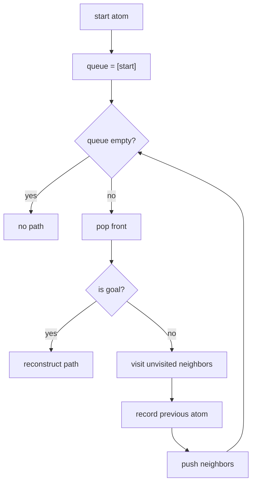
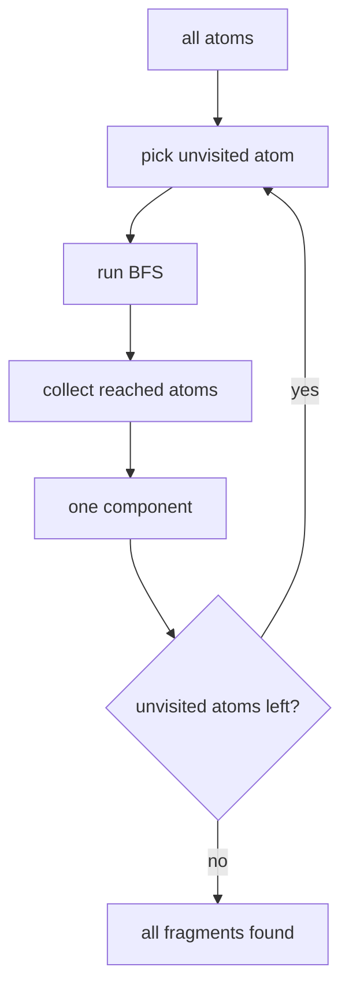

# Mermaid: Graph Algorithms

## Neighbor Lookup

## Breadth-First Search

## Connected Components

Teaching prompt:

Have students run the same algorithm by hand with string bonds before they read the
Rust function.

