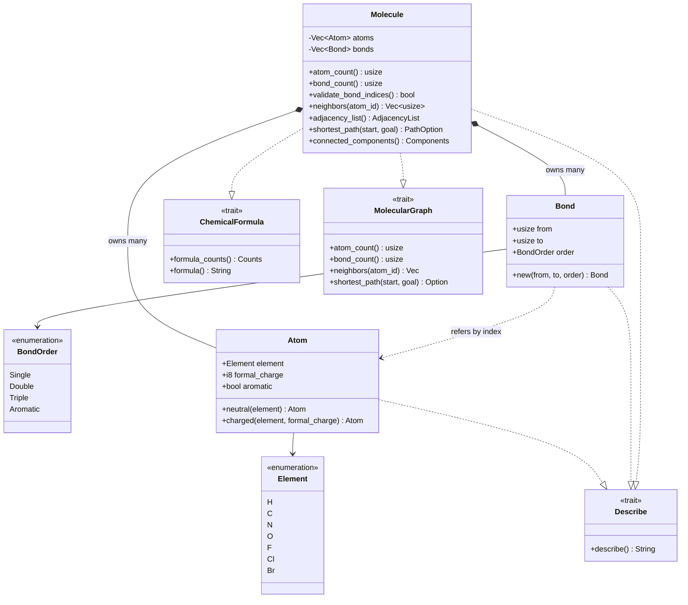
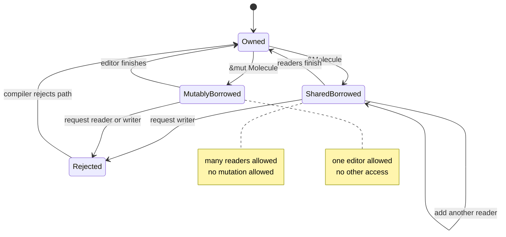
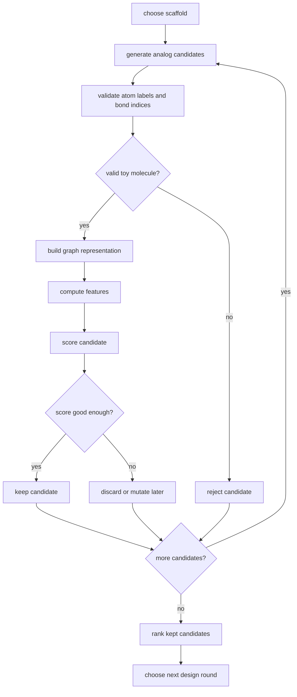
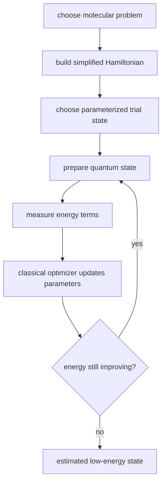

# Mermaid: Models, Contracts, and Flows

These diagrams render directly on GitHub.

## Molecule Data Model

```mermaid
classDiagram
    class Element {
        <<enumeration>>
        H
        C
        N
        O
        F
        Cl
        Br
    }

    class BondOrder {
        <<enumeration>>
        Single
        Double
        Triple
        Aromatic
    }

    class Atom {
        +Element element
        +i8 formal_charge
        +bool aromatic
        +neutral(element) Atom
        +charged(element, formal_charge) Atom
    }

    class Bond {
        +usize from
        +usize to
        +BondOrder order
        +new(from, to, order) Bond
    }

    class Molecule {
        -Vec~Atom~ atoms
        -Vec~Bond~ bonds
        +atom_count() usize
        +bond_count() usize
        +validate_bond_indices() bool
        +neighbors(atom_id) Vec~usize~
        +adjacency_list() AdjacencyList
        +shortest_path(start, goal) PathOption
        +connected_components() Components
    }

    class Describe {
        <<trait>>
        +describe() String
    }

    class ChemicalFormula {
        <<trait>>
        +formula_counts() Counts
        +formula() String
    }

    class MolecularGraph {
        <<trait>>
        +atom_count() usize
        +bond_count() usize
        +neighbors(atom_id) Vec
        +shortest_path(start, goal) Option
    }

    Atom --> Element
    Bond --> BondOrder
    Molecule *-- Atom : owns many
    Molecule *-- Bond : owns many
    Bond ..> Atom : refers by index
    Atom ..|> Describe
    Bond ..|> Describe
    Molecule ..|> Describe
    Molecule ..|> ChemicalFormula
    Molecule ..|> MolecularGraph
```

## Ownership Contract

```mermaid
stateDiagram-v2
    [*] --> Owned
    Owned --> SharedBorrowed: &Molecule
    SharedBorrowed --> Owned: readers finish
    SharedBorrowed --> SharedBorrowed: add another reader
    Owned --> MutablyBorrowed: &mut Molecule
    MutablyBorrowed --> Owned: editor finishes
    SharedBorrowed --> Rejected: request writer
    MutablyBorrowed --> Rejected: request reader or writer
    Rejected --> Owned: compiler rejects path

    note right of SharedBorrowed
        many readers allowed
        no mutation allowed
    end note

    note right of MutablyBorrowed
        one editor allowed
        no other access
    end note
```

## Molecule Design Flow

```mermaid
flowchart TD
    A["choose scaffold"] --> B["generate analog candidates"]
    B --> C["validate atom labels and bond indices"]
    C --> D{"valid toy molecule?"}
    D -- "no" --> E["reject candidate"]
    D -- "yes" --> F["build graph representation"]
    F --> G["compute features"]
    G --> H["score candidate"]
    H --> I{"score good enough?"}
    I -- "yes" --> J["keep candidate"]
    I -- "no" --> K["discard or mutate later"]
    J --> L{"more candidates?"}
    K --> L
    E --> L
    L -- "yes" --> B
    L -- "no" --> M["rank kept candidates"]
    M --> N["choose next design round"]
```

## Quantum-Classical Simulation Loop

```mermaid
flowchart TD
    A["choose molecular problem"] --> B["build simplified Hamiltonian"]
    B --> C["choose parameterized trial state"]
    C --> D["prepare quantum state"]
    D --> E["measure energy terms"]
    E --> F["classical optimizer updates parameters"]
    F --> G{"energy still improving?"}
    G -- "yes" --> D
    G -- "no" --> H["estimated low-energy state"]
```
