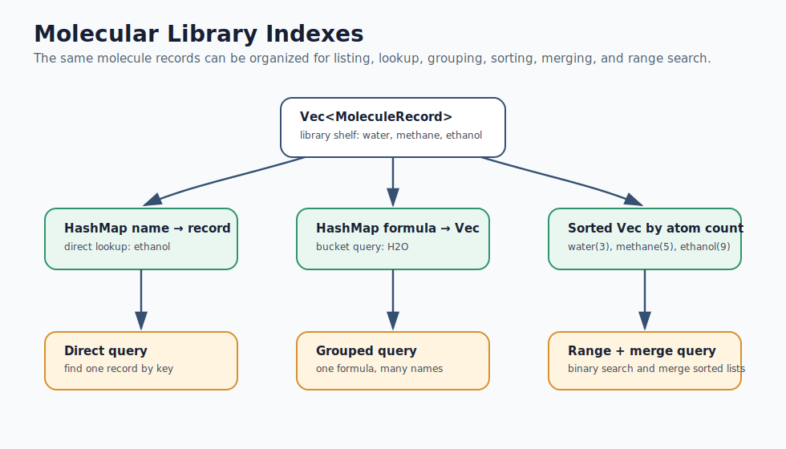
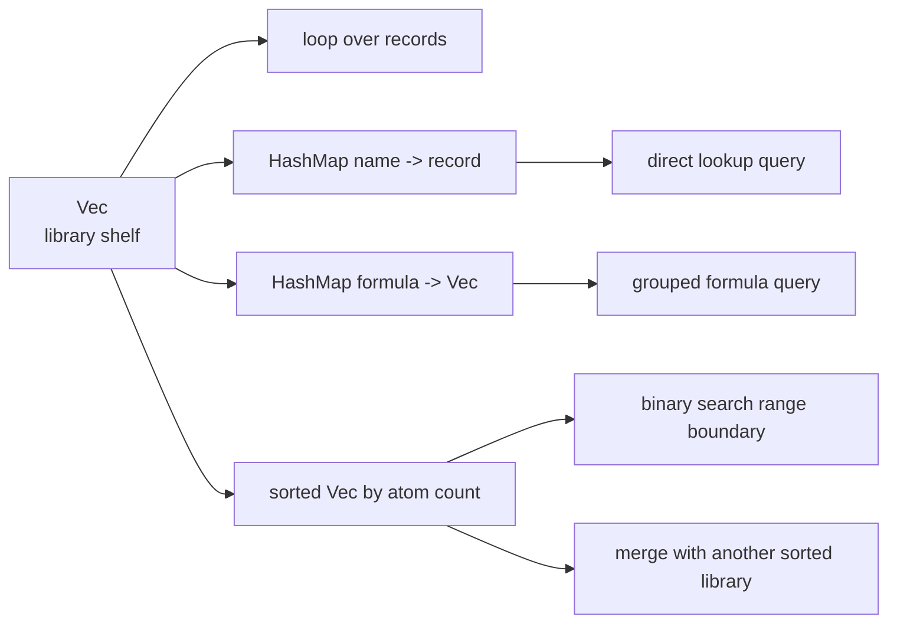

# Mermaid: Molecular Library Indexes

If GitHub Mermaid rendering is unavailable in your browser, use this rendered SVG:

The editable Mermaid source is below.

Teaching prompt:

Ask students which structure they would build for each query before showing the
Rust implementation.
