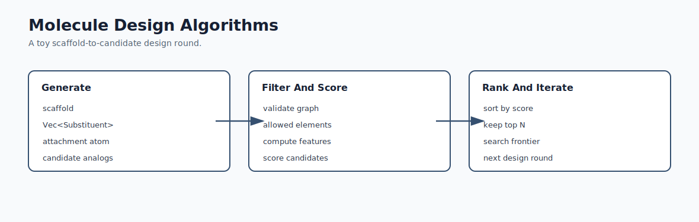
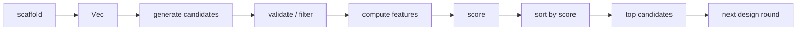
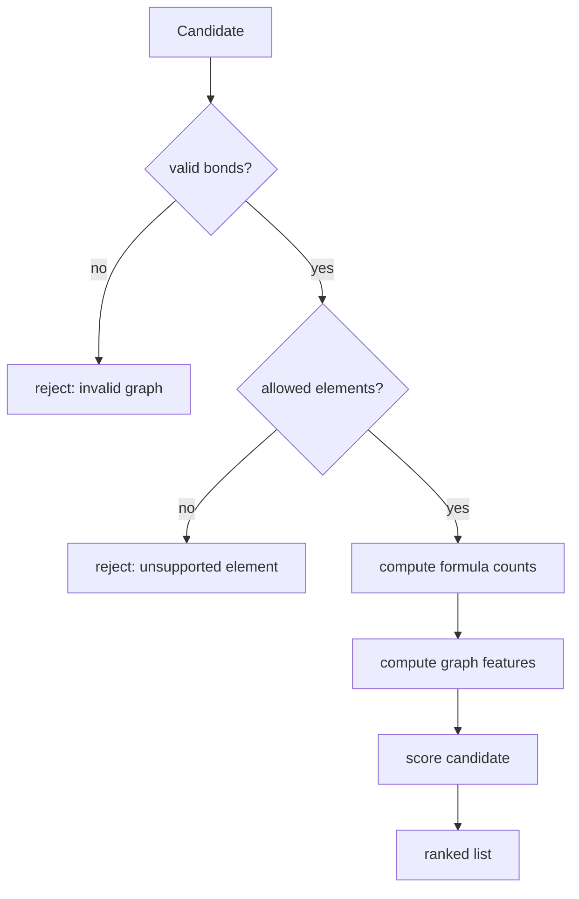
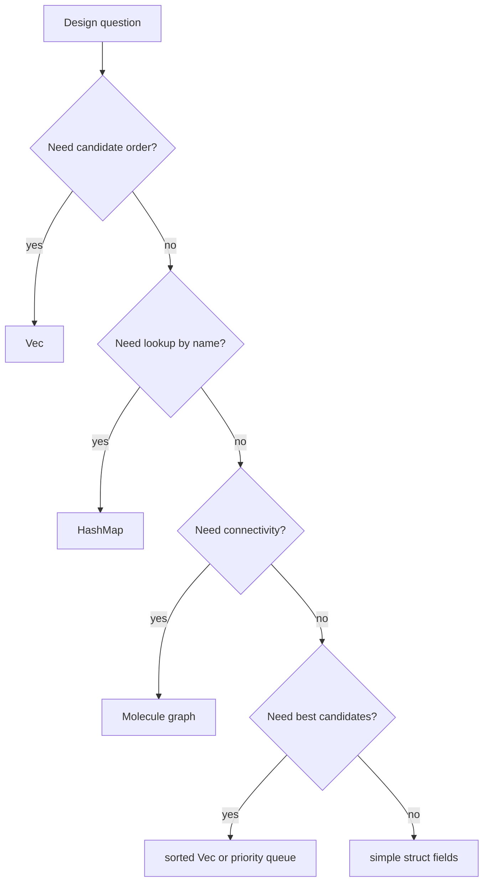
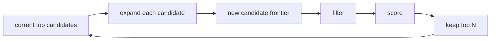

# Mermaid: Molecule Design Algorithms

If GitHub Mermaid rendering is unavailable in your browser, use this rendered SVG:

The editable Mermaid source is below.

## Design Round

## Candidate Data Flow

## Data Structures In Design

## Search Frontier

Teaching prompt:

Ask students to say which data structure owns each stage of the design round.
