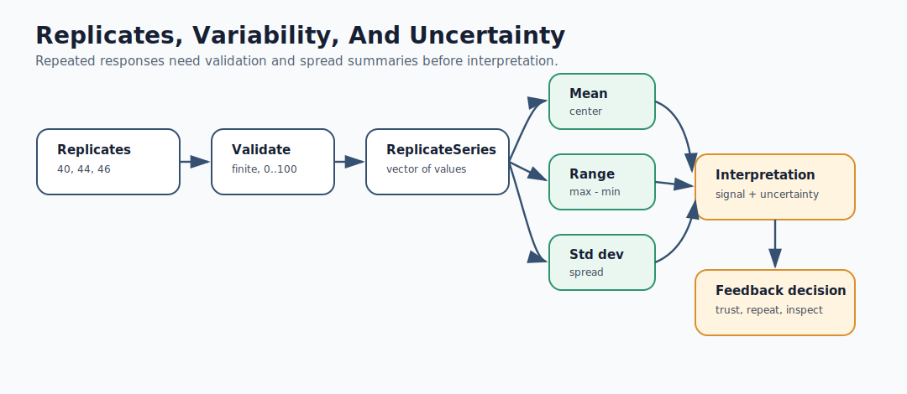
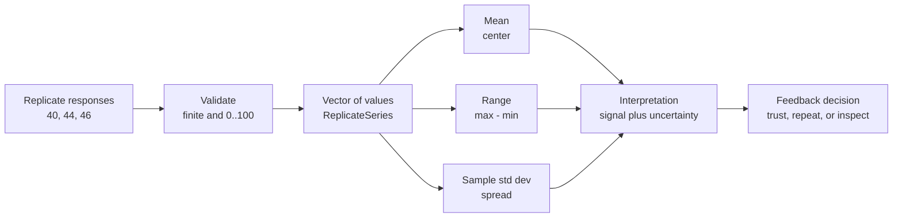

# Mermaid: Replicates And Uncertainty

If GitHub Mermaid rendering is unavailable in your browser, use this rendered SVG:

The editable Mermaid source is below.

Teaching prompt:

Ask students why two candidates can have similar means but different decisions.
