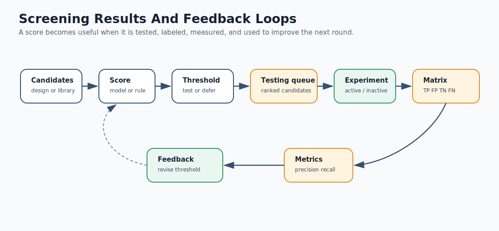
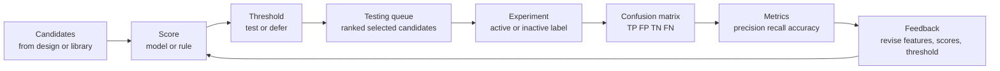

# Mermaid: Screening Feedback Loop

If GitHub Mermaid rendering is unavailable in your browser, use this rendered SVG:

The editable Mermaid source is below.

Teaching prompt:

Ask students where uncertainty enters the loop and which data structure stores it.
