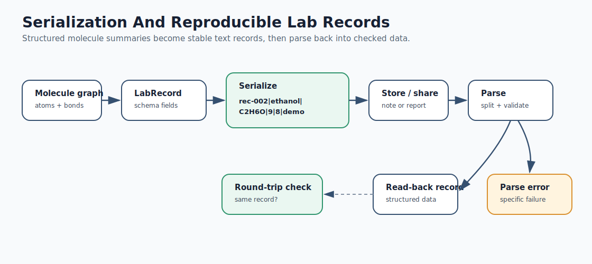
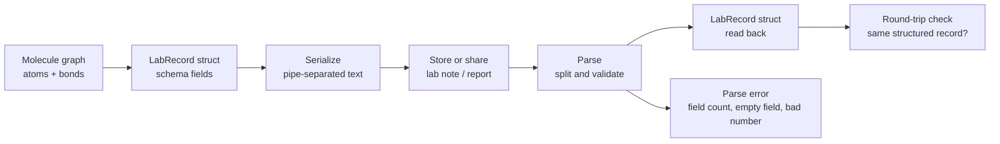

# Mermaid: Serialization And Lab Records

If GitHub Mermaid rendering is unavailable in your browser, use this rendered SVG:

The editable Mermaid source is below.

Teaching prompt:

Ask students what scientific context is missing from the toy record.
