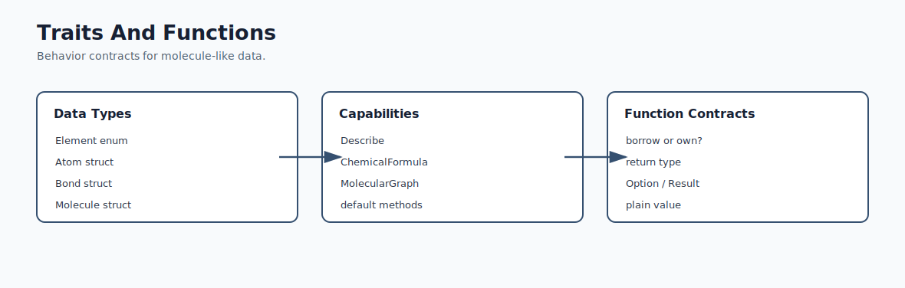
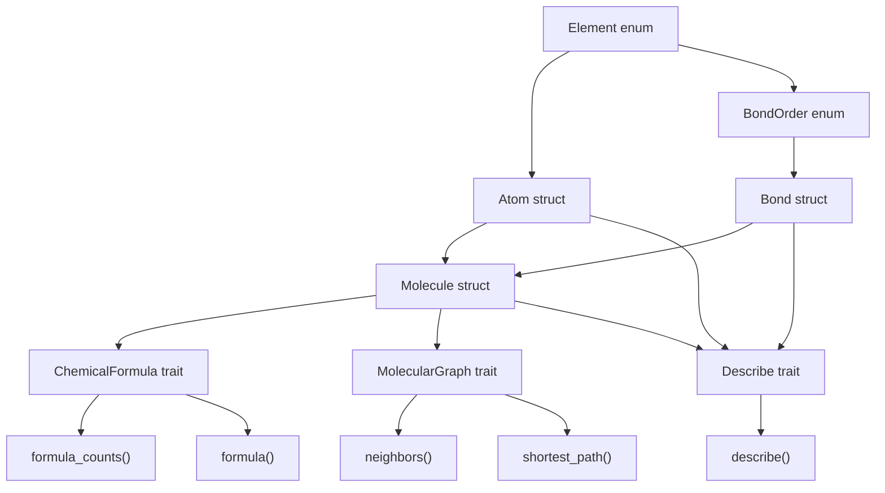
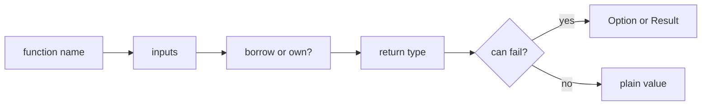
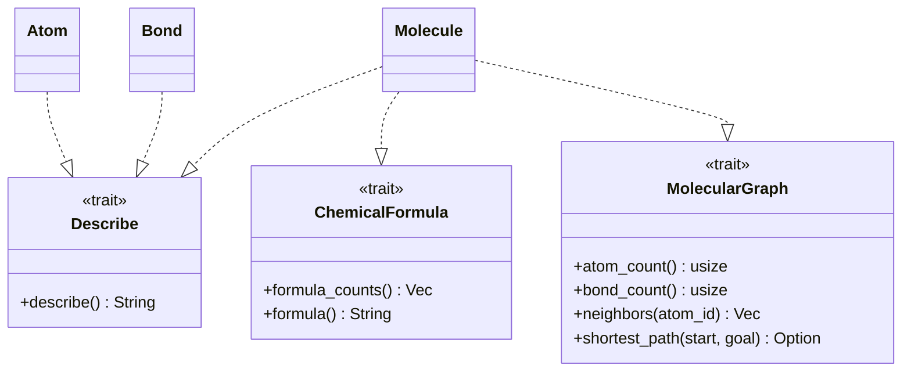

# Mermaid: Traits and Functions

If GitHub Mermaid rendering is unavailable in your browser, use this rendered SVG:

The editable Mermaid source is below.

## Behavior Layers

## Function Contracts

## Trait as Capability

