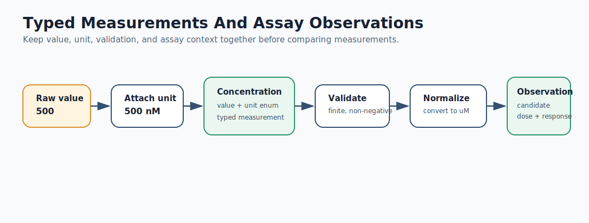
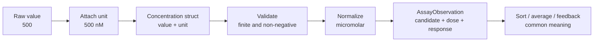

# Mermaid: Typed Measurements And Assay Observations

If GitHub Mermaid rendering is unavailable in your browser, use this rendered SVG:

The editable Mermaid source is below.

Teaching prompt:

Ask students where a bare number can create a wrong scientific conclusion.
